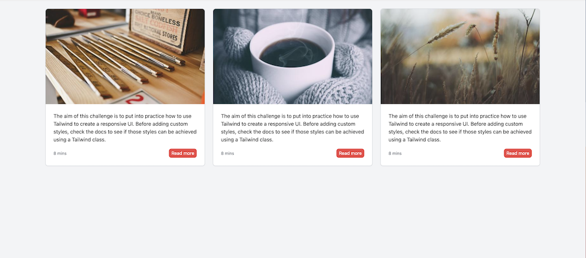
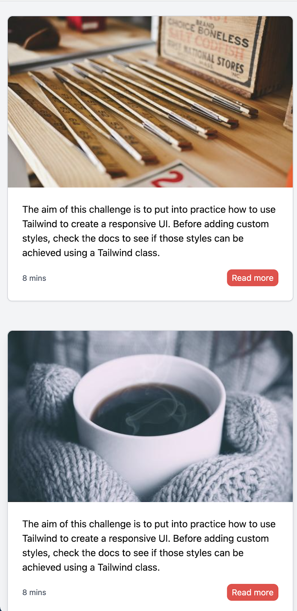
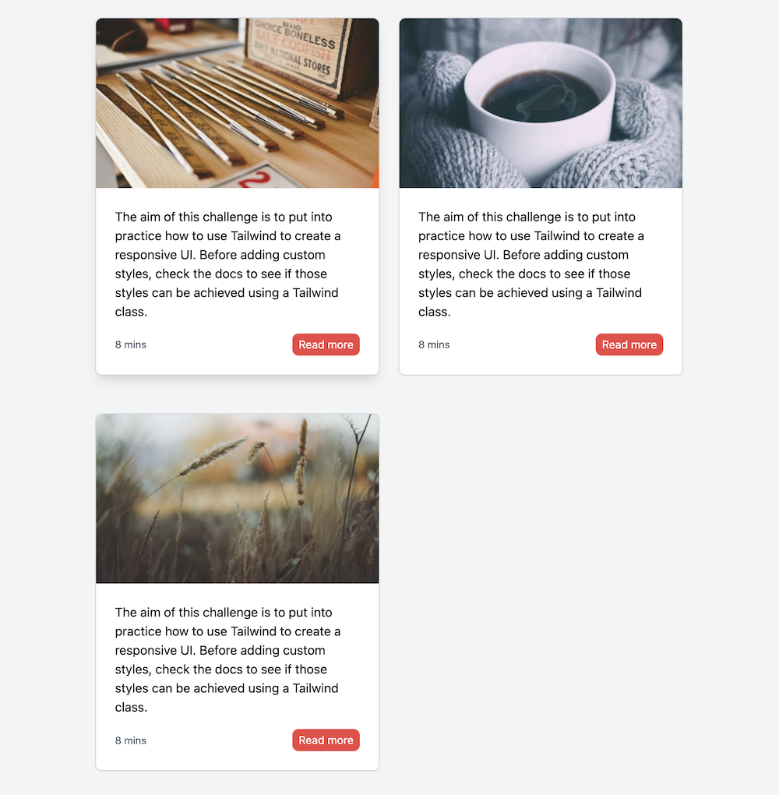

# Tailwind UI Challenge

For this challenge you will need to use [Tailwind](https://tailwindcss.com/docs/installation) classes to build the following responsive layout.

[Watch the video preview](https://youtu.be/rEB4cQifTs4)

This layout contains a main section with a list of 3 responsive cards.

Some considerations that can be seen on the previous video:

1. The image should have an aspect ratio of 5/3.
2. On mouse hover there is a shadow on the card.
3. On mouse hover the "Read more" button, change the background color to a darker one.
4. When the "Read more" button has a focus state, change the background color to a darker one and add a border like shown on the video.
5. Cards should arrange responsively. This means that their layout has to change according to the screen size.
   - For _xs_ and _sm_ there should be 1 card per row, for _md_ 2 and for _lg and bigger_ 3.

**Suggestions:**

- You can use random images from [Lorem Picsum](https://picsum.photos/) like this: https://picsum.photos/500/300?v=1
- You can start from this Tailwind seed project which already has the Tailwind libraries imported.

# What's expected

1. You can build this layout by using just Tailwind classes.
2. You can apply the theories from this lesson to style states accordingly and make your design responsive.

# Objective

The purpose of this challenge is for you to practice your Tailwind skills by creating a real UI. Please note that there is no right or wrong way to solve this. What we want to see is how you can solve this responsive layout just by using Tailwind classes. Please try not to use any custom classes. Have fun playing with Tailwind!
